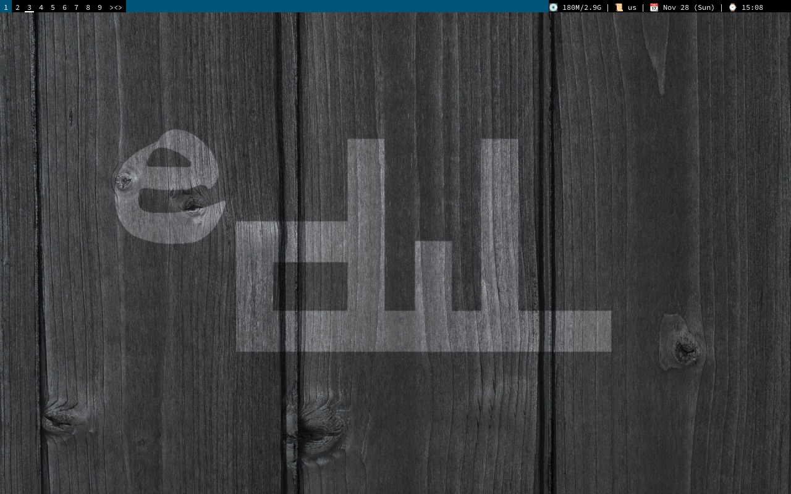

# General
This is my fork of [dwl](https://github.com/djpohly/dwl), easy to use wayland compositor.

I've just riced it with a bar (and some other features) to make it look more like a dwm. I'm fully understand, that this fork doesn't share the suckless philosophy, but it looks and feels just like what I've riced from the dwm. And it's enough for me.

# Usage
## Features
1. A bar. Yeah, pritty simple, but it solves most of my tasks.
   - With a status bar, to be able to set text from external application.
   - With a tray, to be able to close some applications.
   - With a color/font configuration via config.h.
   - With actions to move windows on different tags by click.
2. Additional windows features.
   - Hidden windows. You can hide/show a window by pressing on it's title on bar.
   - Windows carousel. Allow to swap montor's zones for windows.
   - Gaps.
   - Devour.
3. A lockscreen.
   - Actually hides everything and don't allows to send keyboard/mouse events to applications.
   - There was a criticism of standrad lock programs, that they are allows to access an interface to everyone if they crashed. Well, if this one crashes, then everything will be closed. Is this a good or a bad thing - decide for yourself.
4. A background.
   - You could use PNG and JPEG images only.
   - You also could dynamically change them!
   
## What currently in WIP
There are still some things that I'm currently hasn't solved:
1. Tray upgrade. Context menu isn't showing currently.

## Configuration and Building
All configurations are placed in config.h. Everytime after the update you have to recompile the application (like it's done in dwm).
To build this application just run:

    make

Be sure to have all required dependencies:
1. wayland
2. wlroots
3. libsystemd (or alternative API, see config.mk)
4. xkbcommon
5. libinput
6. cairo
7. pango (+ pangocario)
8. libjpeg (libjpeg-turbo)

## Running edwl
Edwl can be run on any of the backends supported by wlroots. This means you can run it as a separate window inside either an X11 or Wayland session.
I'm highly suggesting to use systemd-logind as a session manager to handle required environment variables. Without it, be sure to set up at least XDG_RUNTIME_DIR:

    export XDG_RUNTIME_DIR=/tmp/xdg-runtime-$(id -u)
    mkdir -p $XDG_RUNTIME_DIR
    edwl

# Additional utilities
## Tools
You can use a [edwlblocks](https://gitlab.com/necrosis/edwlblocks) utility, to dynamically change a status on the bar and a background. If you'd like to do it by hand, than you need to now, that the edwl has two functions on dbus, and you can run it via dbus utilities.

    busctl call --user net.wm.edwl /net/wm/edwl net.wm.edwl SetStatus s "insert your status here"
    busctl call --user net.wm.edwl /net/wm/edwl net.wm.edwl SetBackgroundPath s "path-to-a-png-image"

## Devour
You can set *devourcommand* parameter in config to hide a window with a specific title. The default value is *edwldevour*, so, for example, to run a feh with devouring the terminal window you could create an executable script named edwldevour:

    #!/bin/bash
    ${*:1}

Save it in your PATH and use it like this:

    $ edwldevour feh image.jpg

I'm personly using this feature with kitty terminal emulator.

## Autorun
You can set a bunch of applications to be launched on start. Use the autorun setting in the config.

# Example

# More suggestions
Here are some tips & tricks I've figured out while been using it.

## Screen capture
Use [pipewire](https://wiki.archlinux.org/title/PipeWire). I'm using a script to setup it properly on start:

    dbus-update-activation-environment --systemd WAYLAND_DISPLAY XDG_CURRENT_DESKTOP=wlroots
    systemctl --user stop pipewire wireplumber xdg-desktop-portal xdg-desktop-portal-wlr
    systemctl --user start wireplumber

Please notice, that I'm using a [wireplumber](https://wiki.archlinux.org/title/WirePlumber) as a session manager. If you are using a default *pipewire-media-session*, replace a *wireplumber* with it in the script.
For screenshots use [grim](https://sr.ht/~emersion/grim/).

## Pointer in games
I've added a constraint logic for pointers in games, but there are some of them, which has a very strange logic of using it.

### Pointer is not hidden
Met on Deep Rock Galactic. It has it's own pointer in game, but it's not hiding the system's one. Use *togglecursor* function (MODKEY + Shift + X) to hide/show it.

### Pointer is not showing on some conditions
Met in Phasmophobia. In the hub, when you selecting a bord by clicking on it. In this case - press a spacebar to enter settings on boards (or any other buttons to show an in-game pointer).

### Pointer is not game stylised or clicking at the wrong place
Met in League of Legends. First - be sure to run this game in Borderless Window mode (WindowMode=2 in drive_c/Riot Games/League of Legends/Config/game.cfg). Second - move to the next tag and return - should be stylised now.

## Game window has been moved half-screen down and forward
Happens with old stragy games, running via wine/proton. Set a virtual desktop in lutris or in winecfg.
